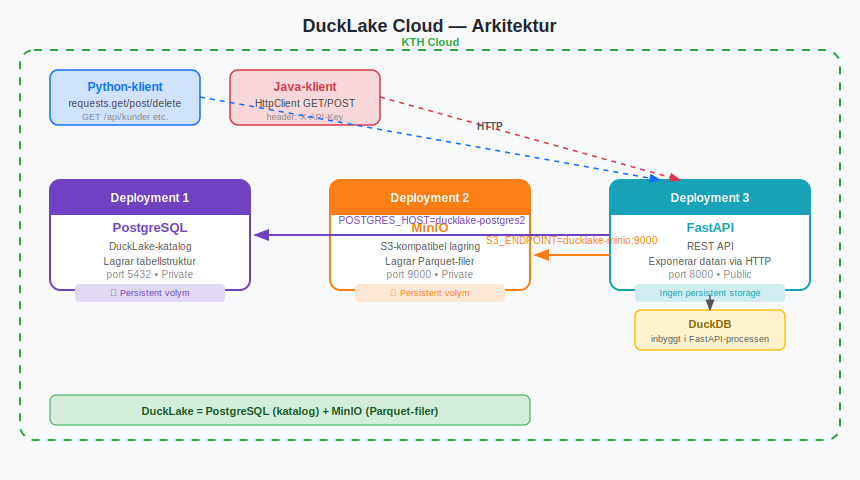
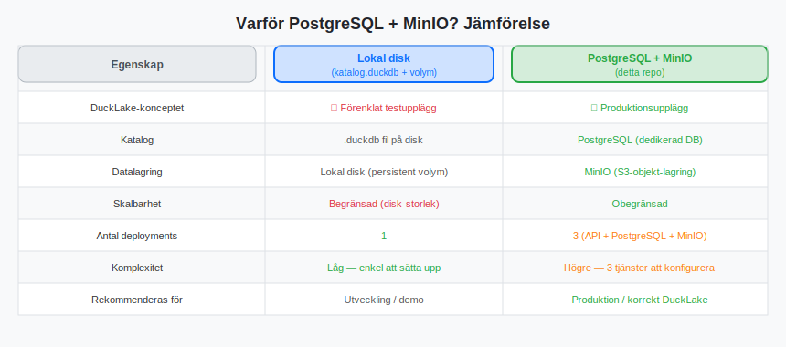
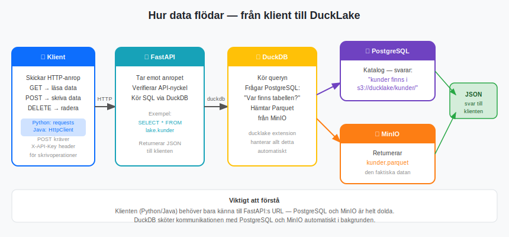

# DuckLake Cloud

En produktionsliknande DuckLake-datalake med **PostgreSQL** som katalog och **MinIO** som Parquet-lagring — det upplägg som DuckLake är designat för.

---

## Vad är DuckLake?

DuckLake är ett öppet lakehouse-format byggt ovanpå DuckDB. Det separerar data i två delar:

- **Katalog** — lagrar metadata: vilka tabeller som finns, deras schema och snapshots
- **Parquet-filer** — lagrar den faktiska datan i kolumnformat

Varje skrivoperation skapar en ny **snapshot** vilket möjliggör *time travel* — du kan läsa historiska versioner av datan.

---

## Arkitektur



Tre separata deployments på KTH Cloud:

| Deployment | Teknologi | Port | Synlighet | Syfte |
|------------|-----------|------|-----------|-------|
| `ducklake-postgres2` | PostgreSQL 16 | 5432 | Private | DuckLake-katalog |
| `ducklake-minio` | MinIO | 9000 | Private | Parquet-filer (S3) |
| `ducklake-api` | FastAPI (Python) | 8000 | Public | REST API |

Klienter (Python, Java, eller annat) pratar **endast** med `ducklake-api` via HTTP. PostgreSQL och MinIO är dolda bakgrundstjänster.

---

## Varför PostgreSQL + MinIO?



---

## Hur data flödar



---

## Starta lokalt

```bash
docker compose up --build
```

- API: `http://localhost:8000`
- MinIO-konsol: `http://localhost:9001` (minioadmin / minioadmin)
- API-dokumentation: `http://localhost:8000/docs`

---

## Driftsätt på KTH Cloud

### Steg 1 — PostgreSQL

1. **New deployment** på [app.cloud.cbh.kth.se](https://app.cloud.cbh.kth.se)
2. Fyll i:
   - **Image:** `postgres:16-alpine`
   - **Port:** `5432`
   - **Visibility:** Private
3. Miljövariabler:
   - `POSTGRES_DB` = `ducklake`
   - `POSTGRES_USER` = `duck`
   - `POSTGRES_PASSWORD` = `<lösenord>`
4. Persistent storage:
   - App path: `/var/lib/postgresql/data`

> **OBS:** 502-fel är normalt för PostgreSQL — KTH Clouds hälsokontroll skickar HTTP men PostgreSQL pratar inte HTTP. Det påverkar inte funktionen.

---

### Steg 2 — MinIO

1. **New deployment**
2. Fyll i:
   - **Image:** `minio/minio`
   - **Port:** `9000`
   - **Visibility:** Private
   - **Image start arguments:** `server /data`
3. Miljövariabler:
   - `MINIO_ROOT_USER` = `minioadmin`
   - `MINIO_ROOT_PASSWORD` = `<lösenord>`
4. Persistent storage:
   - App path: `/data`
5. Health check: ändra till `/minio/health/live`

---

### Steg 3 — API

1. **New deployment**
2. Fyll i:
   - **Image:** `ghcr.io/wildrelation/ducklake-cloud:latest`
   - **Port:** `8000`
   - **Visibility:** Public
3. Miljövariabler:

| Variabel | Värde | Förklaring |
|----------|-------|------------|
| `POSTGRES_HOST` | `<postgres-deployment-namn>` | Adressen till PostgreSQL |
| `POSTGRES_PORT` | `5432` | PostgreSQLs standardport |
| `POSTGRES_DB` | `ducklake` | Databasens namn |
| `POSTGRES_USER` | `duck` | Användaren från steg 1 |
| `POSTGRES_PASSWORD` | `<lösenord>` | Lösenordet från steg 1 |
| `S3_ENDPOINT` | `<minio-deployment-namn>:9000` | Adressen till MinIO |
| `S3_KEY_ID` | `minioadmin` | MinIO-användaren från steg 2 |
| `S3_SECRET` | `<lösenord>` | Lösenordet från steg 2 |
| `S3_BUCKET` | `ducklake` | Bucket-namn i MinIO |
| `API_KEY` | `<valfritt lösenord>` | Skyddar POST/DELETE |

---

## API-endpoints

| Metod | Endpoint | Auth | Beskrivning |
|-------|----------|------|-------------|
| GET | `/api/kunder` | Nej | Hämta alla kunder |
| GET | `/api/produkter` | Nej | Hämta alla produkter |
| GET | `/api/ordrar` | Nej | Hämta alla ordrar |
| POST | `/api/kunder` | **Ja** | Skapa ny kund |
| POST | `/api/produkter` | **Ja** | Skapa ny produkt |
| POST | `/api/ordrar` | **Ja** | Skapa ny order |
| DELETE | `/api/kunder/{id}` | **Ja** | Radera kund |
| DELETE | `/api/produkter/{id}` | **Ja** | Radera produkt |
| GET | `/api/datasets` | Nej | Lista alla tabeller |
| GET | `/api/datasets/{namn}` | Nej | Hämta data från en tabell |
| POST | `/api/datasets/upload` | **Ja** | Ladda upp CSV/Parquet |
| GET | `/healthz` | Nej | Hälsokontroll |

Skrivoperationer kräver headern `X-API-Key: <lösenord>`.

---

## Anslut med Python

```python
import requests

BASE_URL = "https://<ducklake-api-deployment>.app.cloud.cbh.kth.se"
API_KEY  = "ditt-lösenord"

# Hämta data (ingen nyckel krävs)
kunder = requests.get(f"{BASE_URL}/api/kunder").json()

# Skapa ny kund (kräver nyckel)
ny = requests.post(
    f"{BASE_URL}/api/kunder",
    json={"namn": "Anna", "email": "anna@example.com"},
    headers={"X-API-Key": API_KEY}
).json()

# Radera kund (kräver nyckel)
requests.delete(
    f"{BASE_URL}/api/kunder/1",
    headers={"X-API-Key": API_KEY}
)
```

---

## Anslut med Java

```java
HttpClient client = HttpClient.newHttpClient();

// Hämta data (ingen nyckel krävs)
HttpRequest get = HttpRequest.newBuilder()
    .uri(URI.create(BASE_URL + "/api/kunder"))
    .GET().build();
String svar = client.send(get, HttpResponse.BodyHandlers.ofString()).body();

// Skapa ny kund (kräver nyckel)
String json = "{\"namn\":\"Anna\",\"email\":\"anna@example.com\"}";
HttpRequest post = HttpRequest.newBuilder()
    .uri(URI.create(BASE_URL + "/api/kunder"))
    .header("Content-Type", "application/json")
    .header("X-API-Key", API_KEY)
    .POST(HttpRequest.BodyPublishers.ofString(json)).build();
client.send(post, HttpResponse.BodyHandlers.ofString());
```

---

## Källkod

- API-kod: [`api/`](api/)
- Lokal setup: [`docker-compose.yml`](docker-compose.yml)
- Diagram: [`docs/`](docs/)
